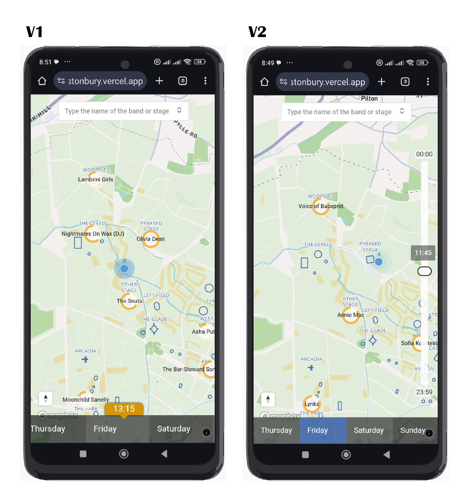
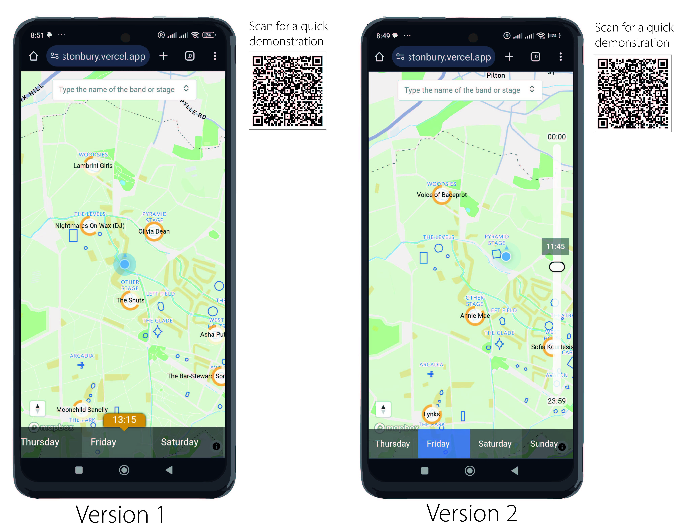

## Info

This repository contains the code of prototype festival map created for the study "Navigation for Festival Maps on Mobile Devices" at ITC, Twente University. A seamless integration of temporal information into the festival map is aimed. The two prototype versions provide two different interaction interfaces for managing temporal information.



Here is a quick demonstration of the search button use: 



## Usage

Those templates dependencies are maintained via [pnpm](https://pnpm.io) via `pnpm up -Lri`.

This is the reason you see a `pnpm-lock.yaml`. That being said, any package manager will work. This file can be safely be removed once you clone a template.

```bash
$ npm install # or pnpm install or yarn install
```

## Available Scripts

In the project directory, you can run:

### `npm run dev` or `npm start`

Runs the app in the development mode.<br>
Open [http://localhost:3000](http://localhost:3000) to view it in the browser. Append /v2 to the URL to view the second prototype.

The page will reload if you make edits.<br>


